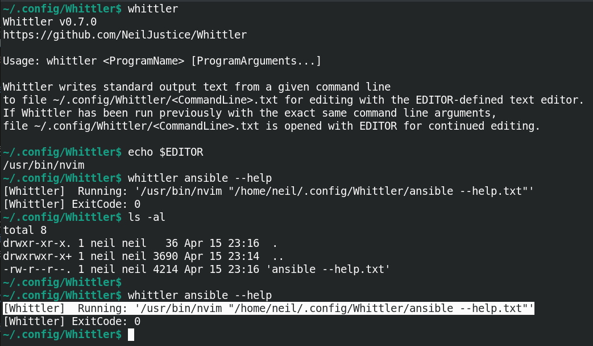
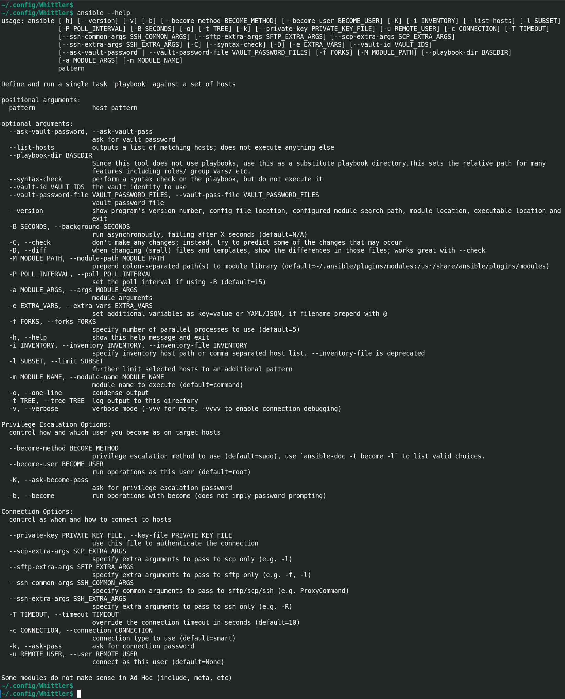
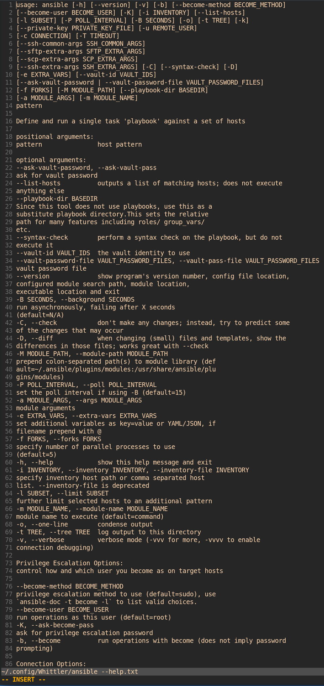
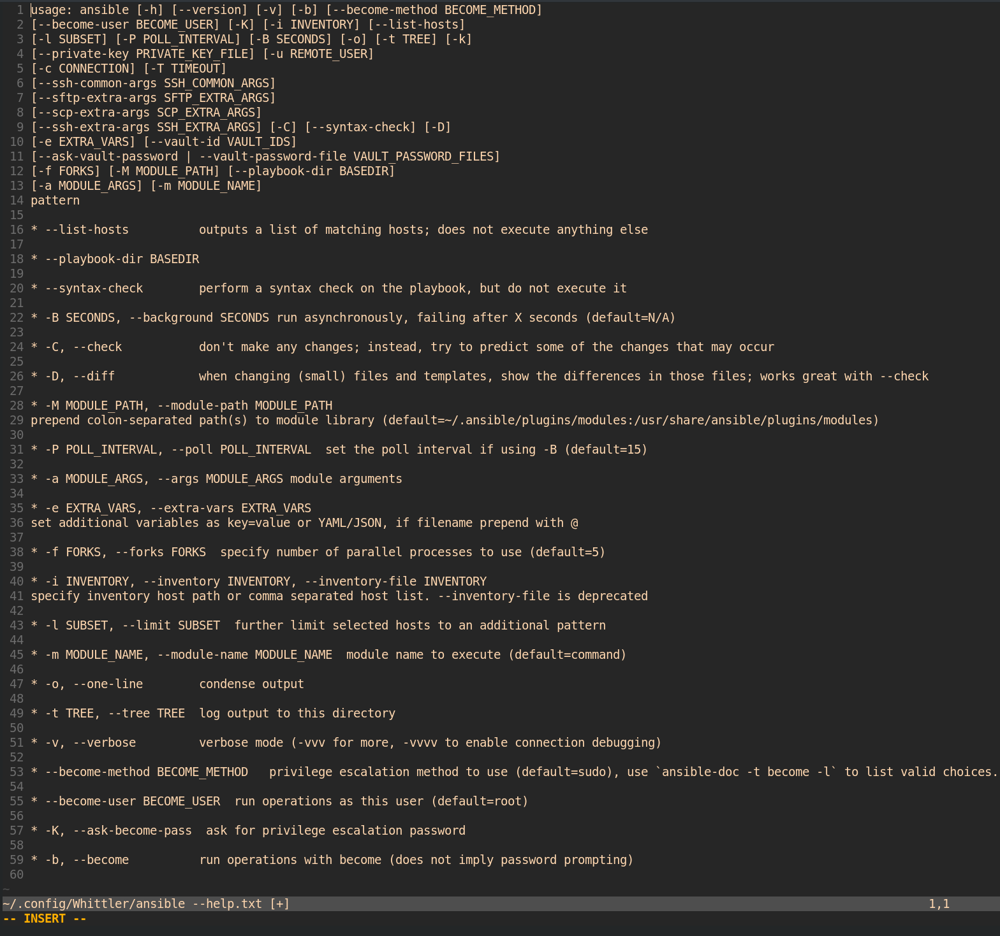
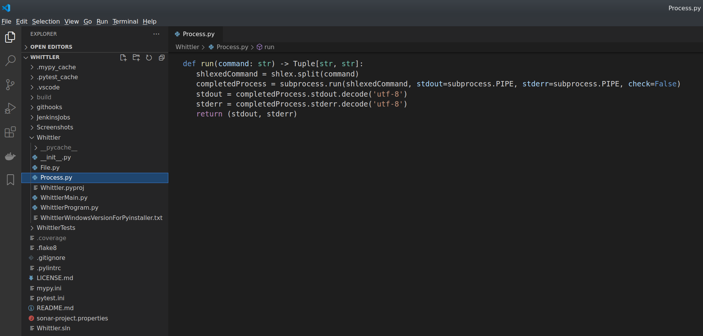
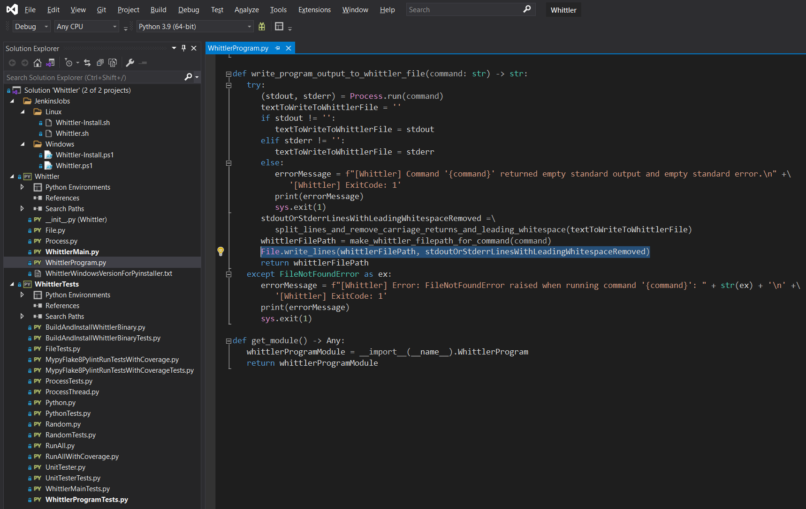
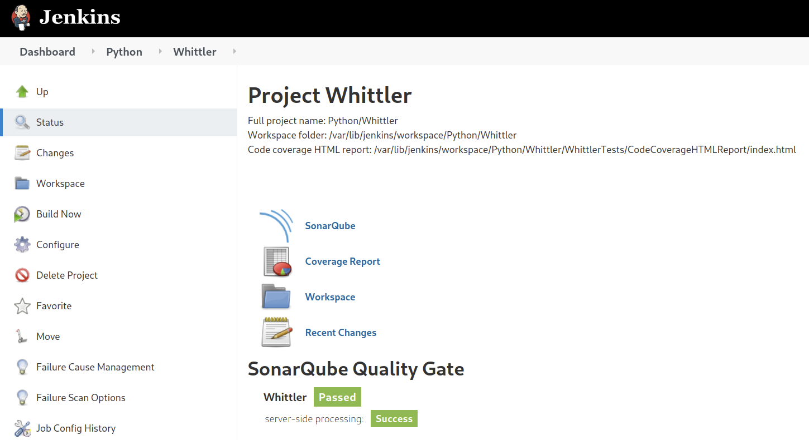
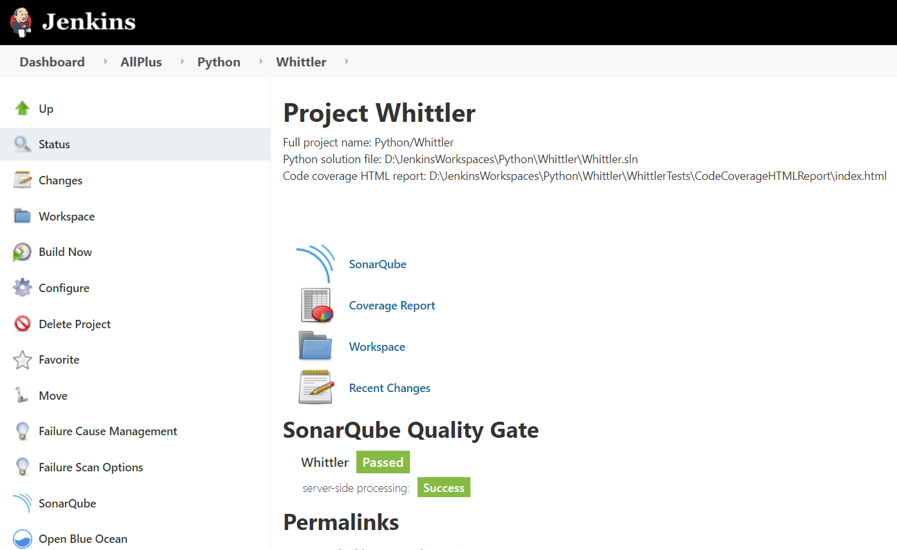
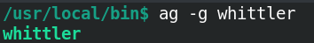
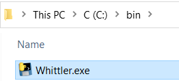

# Whittler

[](https://www.python.org/downloads/release/python-390/) 

Whittler is a Python command line program which facilitates the figurative "whittling away" (deletion) of "inessential" standard output text, especially Linux `program_name --help` standard output text related to command line arguments already understood, resulting in a file containing only the "most essential" standard output text.

For example, when learning a new Linux executable such as `ansible`, one can repeatedly invoke `whittler ansible --help` to iteratively "whittle away" command line arguments and command line argument descriptions so as to be left with a text file containing only `ansible` command line arguments not yet experimented with.

|Build Type|Build Status|
|----------|------------|
|GitHub Actions build for Linux and Windows|[](https://github.com/NeilJustice/Whittler/actions/workflows/build.yml)|
|Codecov.io code coverage|[](https://codecov.io/gh/NeilJustice/Whittler)|
|SonarCloud static analysis|[](https://sonarcloud.io/dashboard?id=NeilJustice_Whittler)|

* [Whittler command line usage](#whittler-command-line-usage)
* [Whittler program behavior](#whittler-program-behavior)
* [Whittler Python code structure as it appears in Visual Studio Code on Linux](#whittler-python-code-structure-as-it-appears-in-visual-studio-code-on-linux)
* [Whittler Python code structure as it appears in Visual Studio 2019 on Windows](#whittler-python-code-structure-as-it-appears-in-visual-studio-2019-on-windows)
* [Linux Jenkins job which unit tests, mypys, flake8s, pylints, SonarQubes, then pyinstaller creates Linux binary whittler](#linux-jenkins-job-which-unit-tests-mypys-flake8s-pylints-sonarqubes-then-pyinstaller-creates-linux-binary-whittler)
* [Windows Jenkins job which unit tests, mypys, flake8s, pylints, SonarQubes, then pyinstaller creates Windows executable Whittler.exe](#windows-jenkins-job-which-unit-tests-mypys-flake8s-pylints-sonarqubes-then-pyinstaller-creates-windows-executable-whittler.exe)
* [How to build and install binary whittler from source on Linux](#how-to-build-and-install-binary-whittler-from-source-on-linux)
* [How to build and install executable Whittler.exe from source on Windows](#how-to-build-and-install-executable-whittlerexe-from-source-on-windows)
* [Whittler roadmap](#roadmap)

## Whittler command line usage

```text
Whittler v0.7.0
https://github.com/NeilJustice/Whittler

Usage: whittler <ProgramName> [ProgramArguments...]

Whittler writes standard output text from a given command line
to file ~/.config/Whittler/<CommandLine>.txt for editing with the EDITOR-defined text editor.
If Whittler has been run previously with the exact same command line arguments,
file ~/.config/Whittler/<CommandLine>.txt is opened with EDITOR for continued editing.
```

## Whittler program behavior

The prime use case for Whittler is to "whittle away" command line arguments and command line argument descriptions for Linux programs in the process of being learned, resulting in a file containing only not-yet-experimented-with command line arguments.

For example, when `whittler ansible --help` is run, standard output for `ansible --help` is written to file `~/.config/Whittler/ansible --help.txt` and is then opened with the `$EDITOR` text editor.

In this screenshot, `$EDITOR` is defined as `nvim`, and contents of directory `~/.config/Whittler` is listed having having run `whittler ansible --help`:



Here is the starting, not-yet-whittled standard output text for `ansible --help`:



Here is the initial view in `nvim` of `whittler ansible --help` with leading spaces removed by Whittler so as to prepare the text for further whittling:



After an initial bout of text whittling, here is one possible instance of whittled-down text for `ansible --help` as opened in `nvim` with `whittler ansible --help`:



Thereafter, whenever `whittler ansible --help` is run, existing file `~/.config/Whittler/ansible --help.txt` is reopened with `$EDITOR` for continued editing / whittling.

## Whittler Python code structure as it appears in Visual Studio Code on Linux

Seen in this screenshot is the `run` function in `Process.py` for running the to-be-whittled command line and returning its standard output and standard error text:



## Whittler Python code structure as it appears in Visual Studio 2019 on Windows

Seen in this screenshot is the code that writes either `stdout` or `stderr` to Whittler file `~/.config/Whittler/<Command>.txt`:



## Linux Jenkins job which unit tests, mypys, flake8s, pylints, SonarQubes, then pyinstaller creates Linux binary whittler

A Jenkins Blue Ocean build pipeline builds the following Jenkins job on Fedora 33 with Python 3.9.2 to statically analyze and unit test Whittler:



## Windows Jenkins Job Which Unit Tests, Mypys, Flake8s, Pylints, SonarQubes, then Pyinstaller Creates Windows Executable Whittler.exe

A Jenkins Blue Ocean build pipeline builds the following Jenkins job on Windows 10 with Python 3.9.4 to statically analyze and unit test Whittler:



## How to build and install binary whittler from source on Linux

```bash
git clone https://github.com/NeilJustice/Whittler
cd Whittler
./JenkinsJobs/Linux/Whittler.ps1
sudo ./JenkinsJobs/Linux/Whittler-Install.ps1
```

Resulting binary `/usr/local/bin/whittler`:



## How to build and install executable Whittler.exe from source on Windows

```powershell
git clone https://github.com/NeilJustice/Whittler
cd Whittler
.\JenkinsJobs\Windows\Whittler.ps1
.\JenkinsJobs\Windows\Whittler-Install.ps1
```

Resulting executable `C:\bin\Whittler.exe`:



## Whittler roadmap

|Future feature|Implementation status as of 4/17/2021|
|--------------|-------------------------------------|
|Replace `unittest` with `pytest`|In progress|
|Replace `coverage` with `pytest.cov`|In progress|
|GitHub Actions build for macos-latest|Awaiting implementation|
